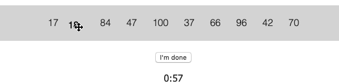

# noops challenges
## Challenge #2 - [SortBot](https://github.com/noops-challenge/sortbot)

> Github posed the noops challenge: https://noopschallenge.com/  -- I accepted
>

Developed in [CodeSandbox](https://codesandbox.io)
--


## Installation
```
git clone `https://github.com/AaronGoldsmith/noOpsSort`

cd noOpsSort
  npm install 
  npm start
```

## Instructions


Working version exclusively permits user account: [AaronGoldsmith](https://github.com/AaronGoldsmith). 

 * Each sorting challenge poses a different instruction set. 
 * Read the instructions and follow the prompt to move to the next level
 * Each round is slightly different and the entire exam is timed
